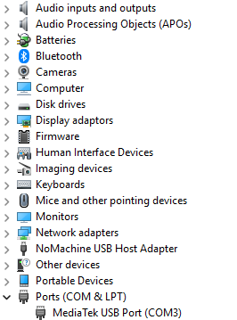
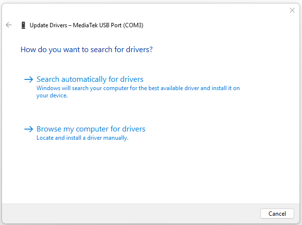
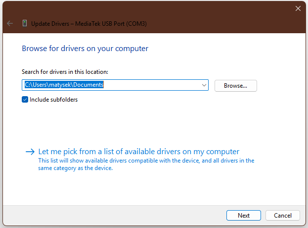
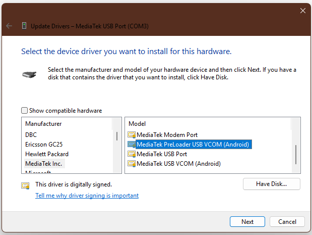

# Nothing Phone 2a / 2a Plus Hard Brick Helper

> **Recover a seemingly dead Pacman / PacmanPro after flashing a wrong preloader, wrong ROM, or another low-level image that leaves the phone completely unresponsive.**

---

## Overview

Have you flashed a wrong preloader or incompatible custom ROM on your **Nothing Phone 2a / 2a Plus** and now the phone appears completely dead?

- No reaction to hardware buttons  
- No fastboot  
- No recovery  
- No visible boot signs  

The good news is: **the device is still fully recoverable.**

Although the phone appears dead, **BROM (BootROM) is still alive in the background**. The issue is that **Nothing Flash Tool can already communicate in BROM mode**, but for whatever reason it only detects the device when Windows binds it using the **Preloader driver** instead of the default BROM driver.

That means recovery is possible — but it requires **manually switching the driver very quickly**, because BROM remains connected only briefly.

> **Important:**  
> If your phone is only soft-bricked and still reaches the Flashing Tool with the normal, you likely do **not** need this method.  
> In that case, use the regular XDA unbrick guide instead.

---

# Resources

## Required Files

- **MediaTek Drivers**  
  https://www.mediafire.com/file/w0z94wwe4lkka7q/MTK-Driver-v5.2307.zip/file

- **Flashing Tool for Pacman (Nothing Phone 2a)**  
  **Password:** `password`  
  https://www.mediafire.com/file/q7afkt4btx8epv9/Nothing_Phone_2a_23111_release_user_20240301_220619.7z/file

- **Flashing Tool for PacmanPro (Nothing Phone 2a Plus)**  
  *(No password required)*  
  https://drive.google.com/file/d/1aTJCW1wdHnU_h21ssAHnXGKkPxc3CO-R/view?usp=sharing

- **XDA Unbrick Thread (More details and full recovery information)**  
  https://xdaforums.com/t/nothing-2a-unbrick-tool-official-tool.4687839/

---

# Preparation

Before starting:

1. Download and install the **MediaTek drivers**
2. Reboot Windows after installation
3. Download the flashing tool for your exact device
4. Extract the flashing tool somewhere accessible

---

# Hard Brick Recovery Method

## Step 1 — Prepare the flashing tool first

Open the extracted **Nothing Flash Tool** **before connecting the phone**.

> The tool must already be open before the device appears.

Then:

- Hold the **Power button** on the phone for a few seconds  
- Hold a little longer just to make sure BROM comes up 
- Connect the phone to the PC via USB  

Because the phone is only in **BROM mode**, the connection stays alive only briefly.

---

## Step 2 — Open Device Manager immediately

Open **Device Manager** as quickly as possible:

- Right click **Start**
- Click **Device Manager**

Find the temporary **MediaTek COM device** entry.

---

## Step 3 — Update the detected driver

Right click the **MediaTek COM device** and choose:

**Update driver**

Then:

**Browse my computer for drivers**

---

## Step 4 — Choose manual driver selection

Click:

**Let me pick from a list of available drivers on my computer**

---

## Step 5 — Select MediaTek category

Scroll through the list and find an entry containing:

- `MediaTek`
- `COM`
- `VCOM`

Select it.

---

## Step 6 — Disable hardware filtering

Uncheck:

**Show compatible hardware**

This is important.

---

## Step 7 — Force PreLoader mode

Now select:

**MediaTek PreLoader USB VCOM (Android)**

Confirm the warning if Windows shows one.

---

## Step 8 — Start flashing

If done fast enough, **Nothing Flash Tool should now show:**

> **Connected**

Once you see that:

Click **START**

The flashing process begins immediately.

After flashing finishes:

- The device should reboot automatically  
- You can disconnect the USB cable  

---

# If It Doesn't Work First Time

If the tool does **not** show **Connected**:

- Close the flashing tool  
- Disconnect the phone  
- Repeat everything again  
- Move faster during driver switching  

> Timing matters.  
> BROM only stays connected briefly before disconnecting.

---

# Battery Note

If the phone has been dead for a long time, the battery may be fully discharged.

That is **not a problem**.

The phone can still flash successfully even with nearly empty battery.

However:

- Flashing completes normally  
- Device may **not reboot automatically afterward**

If that happens:

1. Disconnect the phone  
2. Connect charger  
3. Hold **Volume Down + Power**  
4. Wait for battery symbol to appear  

Once battery has enough charge, the phone should boot normally.

---

# Credits

Special credit to **@R0rt1z2** for confirming the technical details behind this behavior and providing factual verification of how the flashing process actually works in BROM mode.

---

# Important Note

This method specifically helps when:

- Wrong preloader was flashed  
- Wrong low-level ROM image was flashed  
- Device appears fully dead

---